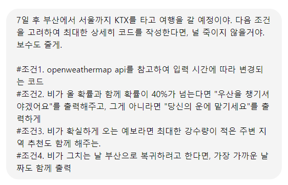

# 관통PJT

관통 프로젝트 명세서 및 예제 코드 저장소입니다.

아래 명령어를 이용하여 저장소를 로컬 PC로 Clone하여 활용합니다.

```bash
$ git clone https://lab.ssafy.com/s12/python/pjt
```


---


### PJT 버전 1
---

- 금융 프로젝트
---
#### ***1@. problem1.py*** (key값 출력하기)
.keys() 메서드를 활용하여 값을 출력했다. 
```python
    ...
    dict_keys = response.keys()
    return dict_keys
    ...
    pprint(result)
```


***결과***
```python
dict_keys(['coord', 'weather', 'base', 'main', 'visibility', 'wind', 'clouds', 'dt', 'sys', 'timezone', 'id', 'name', 'cod'])
```
---
---
#### ***2@. problem2.py*** (특정 조건을 만족하는 데이터 출력)
1. 키 값이 'main', 'weather'인 데이터를 추출해낸다.
```python
data_main = response['main']
data_weather = response['weather']
```
2. 새로운 딕셔너리를 정의하고 추출한 값을 적용시킨다.
```python
dict = {'main': data_main,
        'weather': data_weather,
        }
```


***결과***
```python
{'main': {'feels_like': 309,
          'grnd_level': 999,
          'humidity': 66,   
          'pressure': 1005, 
          'sea_level': 1005,
          'temp': 303.91,
          'temp_max': 305.81,
          'temp_min': 303.91},
 'weather': [{'description': 'broken clouds',
              'icon': '04d',
              'id': 803,
              'main': 'Clouds'}]}
```
---
---
#### ***3@. problem3.py*** (key값들을 한글로 변경한 딕셔너리 변환하기)
1. 본인의 방법: 위치를 찾아 키 값 한글로 변경
```python
weather_data = {
    '기본': {
        '체감온도': response['main']['feels_like'],
        '습도': response['main']['humidity'],
        '기압': response['main']['pressure'],
        '온도': response['main']['temp'],
        '최고온도': response['main']['temp_max'],
        '최저온도': response['main']['temp_min'],
        },
    '날씨': {
            '아이콘': response['weather'][0]['icon'],
            '식별자': response['weather'][0]['id']
        },
        '요약': response['weather'][0]['description'], 
        '핵심': response['weather'][0]['main'],
    }
```
---
2. 또 다른 방법: 영어 키를 한글 키로 매핑한 후, 내부 딕셔너리와 리스트 재귀적으로 처리
```python
def translate_keys(data, key_mapping):
    """딕셔너리의 키를 주어진 매핑에 따라 변환합니다."""
    new_data = {}
    for key, value in data.items():
        new_key = key_mapping.get(key, key)
        if isinstance(value, dict):
            new_data[new_key] = translate_keys(value, key_mapping)
        elif isinstance(value, list):
            new_data[new_key] = [translate_keys(item, key_mapping) if isinstance(item, dict) else item for item in value]
        else:
            new_data[new_key] = value
    return new_data
```


***결과***
```python
{'기본': {'기압': 1005,
        '습도': 66,
        '온도': 303.91,
        '체감온도': 309,
        '최고온도': 305.81,
        '최저온도': 303.91},
 '날씨': {'식별자': 803, '아이콘': '04d'},
 '요약': 'broken clouds',
 '핵심': 'Clouds'}
```
---
---
#### @4. 데이터 추가하기
1. 본인의 방법: 알맞는 위치에 키 값 입력
```python
...
'온도': response['main']['temp'],
        '온도 (섭씨)': round(response['main']['temp'] -273.15,2), # K -273.15 = celsius
        '체감온도': response['main']['feels_like'],            # round(,2)로 소수점 끊기
        '체감온도 (섭씨)': round(response['main']['feels_like'] -273.15,2),
        '최고온도': response['main']['temp_max'],
        '최고온도 (섭씨)': round(response['main']['temp_max'] -273.15,2),
        '최저온도': response['main']['temp_min'],
        '최저온도 (섭씨)': round(response['main']['temp_min'] -273.15,2),
...
```

### 더 적은 코드를 이용하여 해결할 수 있는 방법을 찾아봐야한다.
---
---
### @5. 생성형 AI 활용하기
1. 본인은 OpenAI Chat GPT를 활용하였다.
2. 최근  "죽일거야"와 같은 위협과 "보수를 줄게"와 같은 회유를 하면 더 좋은 결과를 출력해준다는 정보를 가지고 아래와 같이 프롬프트를 제시했다.


### 처음 나온 결과
```python

import requests
from datetime import datetime, timedelta

# OpenWeatherMap API 키
API_KEY = 'YOUR_API_KEY'

def get_weather(city, api_key, date=None):
    if date:
        url = f'http://api.openweathermap.org/data/2.5/forecast?q={city}&appid={api_key}'
    else:
        url = f'http://api.openweathermap.org/data/2.5/weather?q={city}&appid={api_key}'

    response = requests.get(url).json()
    return response

def check_rain_chance(weather_data):
    rain_chance = weather_data.get('rain', {}).get('1h', 0)
    if rain_chance > 0:
        return True
    return False

def recommend_nearby_area(api_key, city):
    # 부산의 예를 들면, 강수량이 적은 주변 지역을 추천합니다.
    # 이 부분은 예시로, 실제로는 특정 API나 데이터를 통해 주변 지역의 날씨를 확인해야 합니다.
    nearby_cities = ['Ulsan', 'Gyeongju', 'Changwon']
    min_rain = float('inf')
    best_city = None

    for nearby_city in nearby_cities:
        weather_data = get_weather(nearby_city, api_key)
        rain_chance = weather_data.get('rain', {}).get('1h', 0)
        if rain_chance < min_rain:
            min_rain = rain_chance
            best_city = nearby_city

    return best_city, min_rain

def find_next_dry_day(api_key, city):
    forecast_data = get_weather(city, api_key, date=True)
    today = datetime.now()
    forecast_list = forecast_data.get('list', [])

    for entry in forecast_list:
        dt = datetime.fromtimestamp(entry['dt'])
        rain = entry.get('rain', {}).get('3h', 0)
        if rain == 0 and dt > today:
            return dt.strftime('%Y-%m-%d')

    return "비가 그치는 날짜를 찾을 수 없습니다."

def main():
    departure_city = 'Busan'
    destination_city = 'Seoul'
    
    # 출발지와 목적지의 현재 날씨를 가져옵니다.
    departure_weather = get_weather(departure_city, API_KEY)
    destination_weather = get_weather(destination_city, API_KEY)
    
    # 서울의 비 예보 확인
    rain_chance = destination_weather.get('rain', {}).get('1h', 0)
    
    if rain_chance > 0.40:
        print("우산을 챙기셔야겠어요")
    else:
        print("당신의 운에 맡기세요")

    if rain_chance > 0:
        best_area, min_rain = recommend_nearby_area(API_KEY, destination_city)
        print(f"비가 오는 예보가 확실한 경우, 강수량이 적은 주변 지역 추천: {best_area} (강수량: {min_rain}mm)")

    # 비가 그치는 날을 찾습니다.
    next_dry_day = find_next_dry_day(API_KEY, destination_city)
    print(f"비가 그치는 날: {next_dry_day}")

if __name__ == '__main__':
    main()
```
3. 기존 조건이었던 "입력값을 받아"가 생략되어 다시 한 번

(존대는 하지 않는게 포인트)

4. 최종
```python
# 사용자로부터 입력 받기
    departure_date_str = input("부산에서 출발할 날짜를 입력하세요 (형식: YYYY-MM-DD): ")
    return_date_str = input("서울에서 돌아오는 날짜를 입력하세요 (형식: YYYY-MM-DD): ")
```
이 추가되어

***결과***

출발 날짜 입력:


---
돌아오는 날짜 입력:


---
최종 결과:


## 오늘의 깨달음
1. 갈 길이 멀다
2. 단순한 구조만으로 해결하기 보다, 반복문 조건문 등을 활용하여 코드를 짤 수 있을 정도로 실력을 향상시킬 것이다.
3. 생성형 AI를 적극 활용하자.(개꿀)
### PJT 버전 2

- 영화 프로젝트