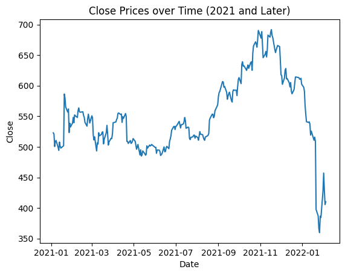
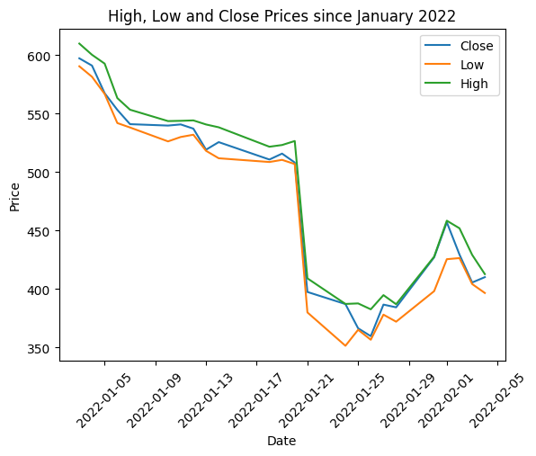
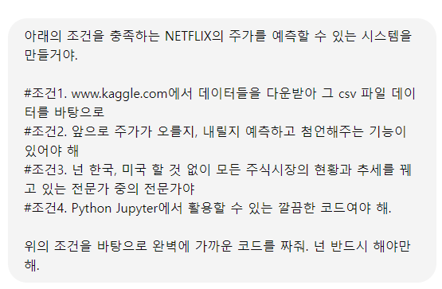
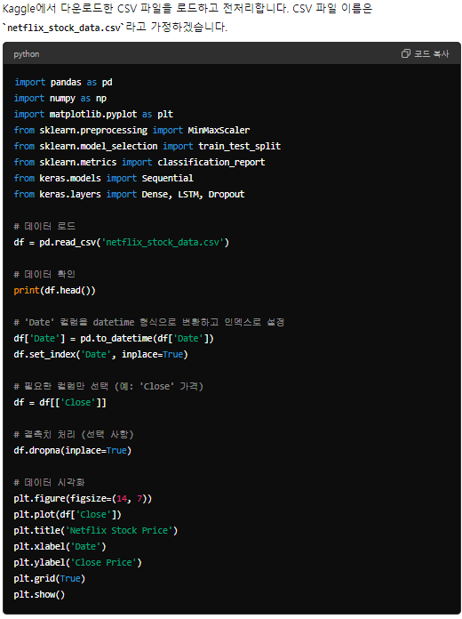
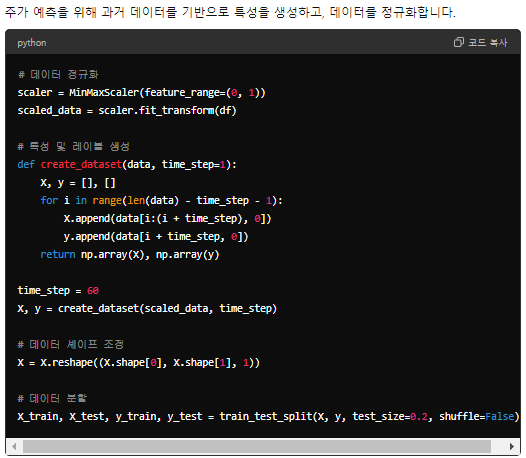
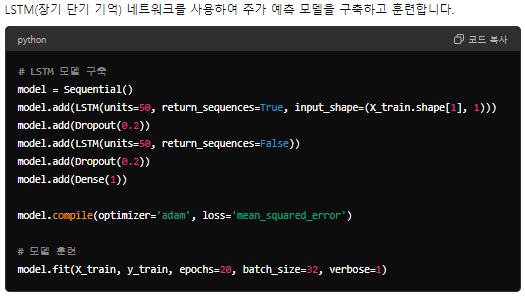
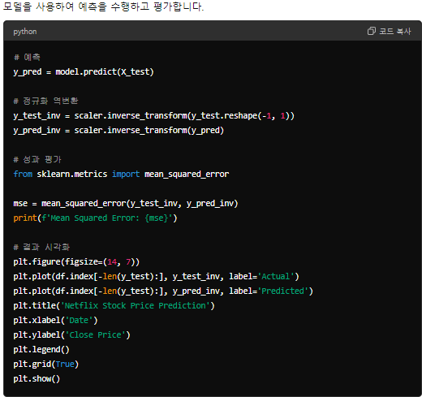
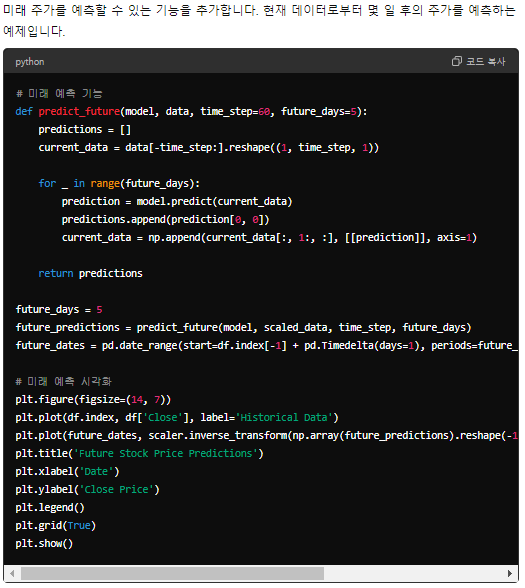
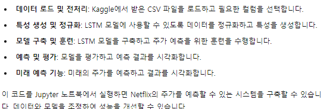

# 관통PJT

관통 프로젝트 명세서 및 예제 코드 저장소입니다.

아래 명령어를 이용하여 저장소를 로컬 PC로 Clone하여 활용합니다.

```bash
$ git clone https://lab.ssafy.com/s12/python/pjt
```


---


### PJT 버전 1

- 금융 프로젝트
 ---
 

# A. 데이터 전처리 - 데이터 읽어오기
 - 필요 패키지 다운로드 중, '!'가 있어야 동작한다는 사실을 알게되었다.
```python
!pip install numpy
!pip install pandas
!pip install matplotlib
```
 - import 하고,
```python
# 패키지 import
import numpy as np
import pandas as pd
import matplotlib.pyplot as plt
```
 -데이터를 읽어온다.
```python
# CSV 파일 경로
csv_path = "archive/NFLX.csv"

# CSV 파일 읽어오기 (['Date', 'Open', 'High', 'Low', 'Close'] 필드만 읽어오도록 구성)
df = pd.read_csv(csv_path, usecols=['Date', 'Open', 'High', 'Low', 'Close'])

# DataFrame 출력
df
```
===
# B. 데이터 전처리 - 2021년 이후의 종가 데이터 출력하기
 - 조건이 붙는 데이터 필터링을 적용하는 것이 어려웠다 (Chat GPT의 도움)
```python
# 날짜 데이터 변환
df["Date"] = pd.to_datetime(df["Date"])

# 2021년 이후의 데이터 필터링
df_filtered = df[df["Date"] >= '2021-01-01']

# 그래프 그리기 (가로, 세로 축에 표시될 데이터를 차례로 기입)
plt.plot(df_filtered['Date'], df_filtered['Close'])

# 그래프 제목 설정
plt.title('Close Prices over Time (2021 and Later)')

# x축 레이블 설정
plt.xlabel('Date')

# y축 레이블 설정
plt.ylabel('Close')

# 그래프 표시
plt.show()
```


# C. 데이터 분석 - 2021년 이후 최고, 최저 종가 출력하기
 - max() 함수와 min() 함수를 이용하여 변수 할당 후 출력하였다.
```python
min_price = df_filtered['Close'].min()
max_price = df_filtered['Close'].max()

print('최저 종가: ', min_price)
print('최고 종가: ', max_price)
```
최저 종가:  359.700012
최고 종가:  691.690002
---
# D. 데이터 분석 - 2021년 이후 월 별 평균 종가 출력하기
 - 3번째 항목 "'Date' 컬럼을 인덱스로 설정"과 4번째 항목 "월별로 데이터 그룹화 및 평균 계산"에서 난항을 겪었다.
 ```python
 # 날짜 데이터 변환
df["Date"] = pd.to_datetime(df["Date"])

# 2021년 이후의 데이터 필터링
df_filtered = df[df["Date"] >= '2021-01-01']

# 'Date' 컬럼을 인덱스로 설정   @@@@@
df_filtered.set_index('Date', inplace=True)

# 월별로 데이터 그룹화 및 평균 계산   @@@@@
monthly_avg = df_filtered['Close'].resample('M').mean()

# 그래프 그리기
plt.plot(monthly_avg.index, monthly_avg)

# 그래프 제목 설정
plt.title('Monthly Average Close Price')

# x축 레이블 설정
plt.xlabel('Date')

# y축 레이블 설정
plt.ylabel('Average Close Price')

# 그래프 표시
plt.show()
```

 - 마찬가지로 Chat GPT의 도움을 받았다.
---
# E. 데이터 시각화 = 2022년 이후 최고, 최저, 종가 시각화하기
```python
# 날짜 데이터 변환
df["Date"] = pd.to_datetime(df["Date"])

# 2022년 이후의 데이터 필터링
df_filtered = df[df["Date"] >= '2022-01-01']
```
 - "label="
```python
# 최고, 최저, 종가 그래프로 그리기
plt.plot(df_filtered['Date'], df_filtered['Close'], label='Close')
plt.plot(df_filtered['Date'], df_filtered['Low'], label='Low')
plt.plot(df_filtered['Date'], df_filtered['High'], label='High')

# 그래프 제목 설정
plt.title('High, Low and Close Prices since January 2022')

# x축 레이블 설정
plt.xlabel('Date')
```
- 글씨를 다 담지 못해서 45도 기울기
```python
# x축 레이블 기울이기(45도)
plt.xticks(rotation=45)

# y축 레이블 설정
plt.ylabel('Price')
```
 - 범례 표시
```python
# 범례 표시
plt.legend()

# 그래프 표시
plt.show()
```

---

# F-a. 생성형 AI를 활용
### 나의 프롬프트
---

---
### 대답
---
1. 필요한 라이브러리 설치


---
2. 데이터 로드 및 전처리


---
3. 특성 생성 및 데이터 정규화


---
4. LSTM 모델 구축 및 훈련


---
5. 예측 및 평가


---
6. 미래 예측 기능 추가


---

## F-b. < 요약 >

### PJT 버전 2

- 영화 프로젝트